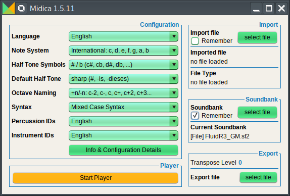

[Get Started](#get-started)
|
[Features](#features-of-the-midica-application-itself)
|
[Screenshots](#screenshots)
|
[Programming](#programming-with-midica)
|
[CLI](#command-line-interface)
|
[Contribute](#contributing)

Midica is an interpreter for a Music Programming Language.
It translates source code to MIDI.

But it can also be used as a MIDI Player, MIDI compiler or decompiler, Karaoke Player, ALDA Player,
ABC Player, LilyPond Player or a MIDI File Analyzer.

You write music with one of the supported languages (MidicaPL, ALDA or ABC).  

The built-in music programming language MidicaPL supports the same techniques as regular programming languages, like:

- Variables and Constants
- Functions
- Loops
- Conditions (if/elsif/else)
- Including Libraries
- Code Comments

You write your songs in plain text files using the text editor of your choice. Midica converts these files into MIDI or plays them directly.

# Get started
1. Install Java Runtume Environment (JRE) version 1.7 or higher.
2. Download the file `midica-VERSION.jar`.
3. Start Midica using the command: `java -jar midica-VERSION.jar`
4. Download one of the [example files](examples/) or create your own file and save it with the file extension `.midica`.
5. In the Midica application, load this file by pressing the upper right button `select file`.
6. Switch to the MidicaPL tab (it's the default tab) and choose this file.
7. Press the button `Start Player` and play the sequence

If you prefer to write your music in ALDA or ABC, you need to:

- Install [ALDA](https://github.com/alda-lang/alda) or [abcMIDI](https://ifdo.ca/~seymour/runabc/top.html)
- In Step 4: Download an [ALDA example](https://github.com/alda-lang/alda-core/tree/master/examples) or [ABC example](https://abcnotation.com/search) or create your own file with the extension `.alda` or `.abc`.
- In Step 6: Switch to the ALDA or ABC tab (any maybe adjust the program path).

# Features of the Midica Application itself

- **Loading and playing** MIDI sequences from:
    - MidicaPL files
    - MIDI files
    - ALDA files (if [ALDA](https://github.com/alda-lang/alda) is installed)
    - ABC files (if [abcMIDI](https://ifdo.ca/~seymour/runabc/top.html) is installed)
    - LilyPond files (if [LilyPond](https://lilypond.org/) is installed)
    - MusicXML, MuseScore, Guitar Pro, Capella, Bagpipe Music Writer, Sonicscores (Overture / Score Writer), PowerTab (if [MuseScore](https://musescore.org/) is installed)
- **Exporting MIDI sequences**
    - As MIDI files
    - As MidicaPL files (experimental)
    - As ALDA files (experimental)
- **Integrated MIDI player** featuring:
    - Regulation of volume, tempo and pitch transposition
    - Memorizing a position in the MIDI sequence and jumping back to that position
    - Channel Overview (showing current instrument and channel activity)
    - Channel Detail viewer (Note name and number, volume and tick, channel by channel)
    - Channel configuration (Volume, Mute and Solo configurable channel by channel)
    - Quick reloading and reparsing of a loaded file
- **Karaoke Player**
    - Integrated as a part of the MIDI player
    - displaying syllables in different colors for future and past
    - displaying syllables in italic, shortly before they must be sung
- **Converter**
    - converts various formats to MIDI (MidicaPL, ALDA, ABC, LilyPond, MusicXML, MuseScore, Guitar Pro, Capella, Bagpipe, Overture, Score Writer, PowerTab)
    - converts MIDI to various formats (MidicaPL, ALDA)
- **Soundfonts**
    - Loading Soundfonts and using them for playback
    - Analyzing Soundfont contents
    - Test Soundfonts with the Soundcheck window
- **Configuration** of
    - GUI language (currently English or German)
    - Note System - (6 different systems), e.g. International (C,D,E,F,G,A,B), German (C,D,E,F,G,A,H), Italian (Do,Re,Mi,Fa,Sol,La,Si)
    - Half Tone Symbols (6 different systems)
    - Octave Naming - 4 different systems
    - Syntax (3 different sets of key words for the programming language) - not _that_ important as the syntax can be redefined in MidicaPL anyway
    - Percussion IDs (English or German)
    - Instrument IDs (English or German)
    - Key bindings

# Screenshots

You can find a lot of screenshots here: http://www.midica.org/screenshots.html

I will not repeat them all in this Readme. But at least here are three screenshots.
The first one shows the main window.
The second one shows the player in default mode.
The third one shows the player in Karaoke mode.




# Programming with Midica

Midica has its own Music Programming Language: MidicaPL. But alternatively you can also code in [ALDA](https://github.com/alda-lang/alda/blob/master/doc/index.md) or [ABC](https://abcnotation.com/learn).

You can find a MidicaPL tutorial here:

- [Preparation](http://www.midica.org/tutorial.html)
- [Chapter 1](http://www.midica.org/tutorial-1.html)
- [Chapter 2](http://www.midica.org/tutorial-2.html)
- [Chapter 3](http://www.midica.org/tutorial-3.html)
- [Chapter 4](http://www.midica.org/tutorial-4.html)
- [Chapter 5](http://www.midica.org/tutorial-5.html)

Examples of complete songs can be found in the [examples directory](examples/).

In this Readme one short example shall be enough:

	// initialize channel 0 and 1
	INSTRUMENTS
	    0  ACOUSTIC_GRAND_PIANO  Piano (Right Hand)
	    1  ACOUSTIC_GRAND_PIANO  Piano (Left Hand)
	END
	
	*  key    d/min            // key signature
	*  time   3/4              // time signature
	*  tempo  170              // tempo in beats per minute
	
	{ q=2                      // outer block to be repeated twice
	    { q=3                  // inner block to be repeated 3 times
	        1  d-  /8  v=70    // channel 1: play D3 as an 8th note, using mezzo piano
	        0  d   /8  v=70    // channel 0: play D4 and switch to mezzo piano
	        0  -   /8          // play a rest
	        0  d   /8
	        0  d#  /8
	        0  d   /8
	        0  d#  /8
	        *                   // synchronize: bring all channels to the same time
	    }
	    1  d-  /4
	    1  f-  /4
	    1  c-  /4
	    0  d   /8
	    0  -   /8
	    0  d   /8
	    0  d#  /8
	    0  f   /8
	    0  d#  /8
	}

This results in a MIDI sequence like this:


# Command Line Interface

By default (without arguments) Midica is started in GUI mode.
But you can provide command line arguments:

```
java -jar midica.jar [ARGUMENTS]
```

You can see all available arguments with `--help`:

```
java -jar midica.jar --help
```

This explains which arguments are available and how they work:

```
ARGUMENTS:
--help                : Print this message.
--cli                 : Run in CLI mode (command line interface) without GUI.
                        Exits after all CLI related work is done.
--keep-alive          : Don't exit, even if --cli has been used.
                        Mainly used for unit tests.
--ignore-local-config : Doesn't use local config file. Use default config.
                        Without this argument the config is read from and
                        written into the file '.midica.conf' in the current
                        user's home directory.
--soundfont=PATH      : Use the specified soundfont file.
--import=PATH         : Import from the specified MidicaPL file.
--import-midi=PATH    : Import from the specified MIDI file.
--import-alda=PATH    : Import from the specified ALDA file by calling the
                        alda program. (ALDA needs to be installed.)
--import-abc=PATH     : Import from the specified ABC file by calling
                        midi2abc. (abcMIDI needs to be installed.)
--import-ly=PATH      : Import from the specified LilyPond file by calling
                        lilypond. (LilyPond needs to be installed.)
--import-mscore=PATH  : Import from the specified file using MuseScore
                        (MuseScore needs to be installed.)
--export-midi=PATH    : Export to the specified MIDI file.
--export=PATH         : Export to the specified MidicaPL file. (*)
--export-alda=PATH    : Export to the specified ALDA file. (*)

(*) A file is exported to STDOUT if the export PATH is a dash (-).
    E.g. --export=-
```

# Contributing

If you want to contribute, please check the [Readme file for Developers](build_helper/README.md).